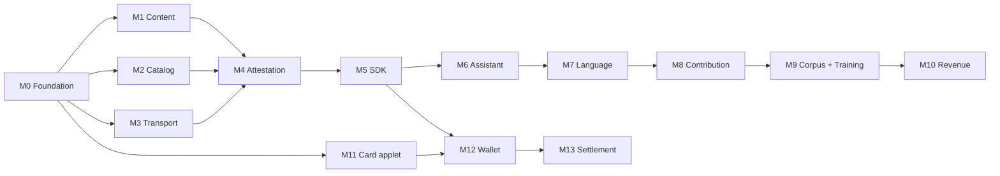

# ShareNet — Implementation Roadmap for Autonomous Agents

**Audience:** AI coding agents (Gemini / Android Studio Agent) executing implementation, plus the human reviewing their output.
**Companion to:** `sharenet-platform-strategy.md` (the *why*), `offline-telecom-roadmap.md` (mesh background).
**Scope:** Full platform plus both first-party applications, built together.

---

## 0. How to use this document

This is an execution spec, not a discussion document. Technology choices are **locked** — do not re-evaluate them. Where a decision was genuinely open, it has been made and the rationale recorded so an agent does not relitigate it.

### 0.1 Agent working rules

1. **One milestone per branch.** Do not start milestone N+1 until N's acceptance criteria pass.
2. **Tests before implementation.** Every milestone lists acceptance criteria; write them as executable tests first.
3. **Never invent APIs.** If a library method is uncertain, read the dependency source or write an integration probe. Do not hallucinate signatures.
4. **Stub across module boundaries.** Every module has an interface defined at M0. Depend on interfaces, never on another module's internals — this allows parallel work.
5. **No network calls in unit tests.** Fake transports and fake clocks are provided at M0.
6. **Deterministic crypto in tests.** Seeded key generation; never random in assertions.
7. **Flag human-blocked work** rather than faking it. §7 lists what agents cannot complete.
8. **Every module gets a README** stating its contract and invariants.

### 0.2 Definition of done, per milestone

- Acceptance tests pass in CI
- `./gradlew lint detekt` clean
- Module README updated
- No `TODO` without a linked issue reference

---

## 1. Locked technology decisions

| Concern | Decision | Why (do not revisit) |
| --- | --- | --- |
| Primary platform | **Android, minSdk 26 (8.0)** | ~90% regional share; iOS deprioritised |
| Language | **Kotlin throughout** | A Rust core with UniFFI adds severe friction for agent-driven work. Extract later only if iOS happens. |
| UI | **Jetpack Compose** | — |
| Local DB | **Room + SQLCipher** | Encrypted at rest, standard tooling |
| Crypto | **Google Tink** (Ed25519, AES-GCM, HKDF) | Agent-friendly, well-documented, Google-native |
| P2P transport | **Nearby Connections API**, `P2P_CLUSTER` | Handles BLE + BT Classic + Wi-Fi Direct automatically. Massive simplification. ⚠️ Requires Play Services — see §7.1 |
| LLM inference | **MediaPipe LLM Inference API** | Official Android path; Gemma 3 1B / 4B. llama.cpp via JNI is the documented fallback only if MediaPipe blocks. |
| Translation / ASR runtime | **ONNX Runtime Mobile** | NLLB-distilled and Whisper exports |
| ASR | **whisper.cpp** (tiny/base), fine-tuned per language | — |
| TTS | Android `TextToSpeech` (EN/FR); **Piper/VITS via ONNX** (local languages) | — |
| Backend API | **FastAPI + PostgreSQL** | Training pipeline is Python; avoid a second language for ML glue |
| Backend crypto | **HSM or cloud KMS** for issuer/catalog keys | Never in application code |
| Card platform | **JavaCard 3.x applet on NXP JCOP-class SE** | User decision; see §6 |
| Card testing | **jCardSim** | Lets agents test applets without hardware |
| Monorepo build | **Gradle (Android) + uv/pyproject (backend)** | — |

---

## 2. Repository layout

```
sharenet/
├── android/
│   ├── core-crypto/          Identity, signing, key storage
│   ├── core-content/         Chunking, CAS, Merkle, blob store
│   ├── core-catalog/         Manifests, publisher trust, revocation
│   ├── core-transport/       Nearby Connections abstraction + fakes
│   ├── core-attest/          Delivery receipts, contribution ledger
│   ├── sharenet-sdk/         Public API surface for apps
│   ├── app-demo/             Reference consumer; proves the SDK
│   ├── app-assistant/        AI assistant
│   ├── app-wallet/           NFC value transfer terminal
│   └── testing/              Fake transport, fake clock, fixtures
├── card-applet/              JavaCard applet + jCardSim harness
├── backend/
│   ├── catalog/              Manifest signing, publisher registry, revocation
│   ├── attest/               Receipt ingest, fraud scoring, points ledger
│   ├── corpus/               Contribution ingest, scoring, dataset assembly
│   ├── training/             Fine-tuning pipeline, eval, model release
│   ├── settlement/           Card settlement, payouts, clawback
│   └── common/
└── docs/
```

---

## 3. Core data model

Define these at **M0** as Kotlin data classes and Postgres schema simultaneously. Everything downstream depends on them.

```kotlin
// Stable identity — Ed25519 public key is the primary key everywhere
data class NodeId(val publicKey: ByteArray)          // 32 bytes

// Content addressing
data class ChunkId(val sha256: ByteArray)            // 32 bytes
data class BlobId(val merkleRoot: ByteArray)         // 32 bytes

data class Manifest(
    val blobId: BlobId,
    val chunks: List<ChunkId>,      // ordered; Merkle leaves
    val totalBytes: Long,
    val mimeType: String,
    val publisherId: NodeId,
    val publishedAt: Long,
    val expiresAt: Long?,
    val signature: ByteArray        // publisher over canonical encoding
)

data class CatalogEntry(
    val manifest: Manifest,
    val category: Category,         // EDUCATION, HEALTH, APP_UPDATE, MODEL_WEIGHTS, DATASET
    val priority: Int,              // REVOCATION = max
    val minAppVersion: Int
)

// Attestation — the unit that earns money
data class DeliveryReceipt(
    val blobId: BlobId,
    val bytesDelivered: Long,
    val senderId: NodeId,
    val recipientId: NodeId,
    val timestamp: Long,
    val nonce: ByteArray,           // recipient-generated, anti-replay
    val recipientSignature: ByteArray  // recipient signs; sender cannot forge
)

// Contribution — the unit that earns model revenue
data class Contribution(
    val id: UUID,
    val contributorId: NodeId,
    val sourceLang: String,         // BCP-47 + custom: twi, ewe, gaa
    val targetLang: String,
    val sourceText: String,
    val correctedText: String,
    val originalModelOutput: String?,
    val modelVersion: String?,
    val capturedAt: Long,
    val signature: ByteArray
)
```

**Canonical encoding rule:** all signed structures use deterministic CBOR. Write the codec once in `core-crypto` at M0 and share it with the backend via a golden-vector test file. Signature mismatches between Kotlin and Python are the single most likely integration bug in this project.

---

## 4. Milestones — Platform

### M0 — Foundation *(blocks everything)*

Scaffold the monorepo, CI, all module skeletons with interfaces only, the data model above, deterministic CBOR codec, `core-crypto` (Ed25519 keygen, sign, verify, Android Keystore integration), and the `testing` module (fake transport, fake clock, seeded key fixtures).

**Acceptance**
- Golden-vector test: Kotlin and Python produce byte-identical CBOR and signatures for 20 fixture structures
- Key survives app restart via Keystore
- CI runs Android unit tests and backend pytest on every push

---

### M1 — Content layer

Rolling-hash chunking (target 1 MB, min 256 KB, max 4 MB), SHA-256 chunk IDs, Merkle tree, blob store on disk with LRU eviction under a configurable quota, resumable partial-blob assembly, integrity verification on read.

**Acceptance**
- 3 GB file chunks and reassembles byte-identically
- Corrupt one chunk on disk → verification fails, chunk is refetched, not the whole blob
- Interrupt at 40% → resumes without re-downloading complete chunks
- Quota enforcement evicts LRU and never evicts a pinned blob

---

### M2 — Catalog layer

Publisher registry with a pinned root key, manifest signature verification, **revocation list with strict priority propagation**, category and version filtering, local catalog store.

**Acceptance**
- Unsigned or wrong-key manifest is rejected and never written to the blob store
- Revocation entry propagates ahead of a large queued content transfer *(explicit ordering test)*
- Revoked blob is deleted from local store within one catalog sync
- Root key rotation works with a signed transition

---

### M3 — Transport layer

Wrap Nearby Connections behind `Transport` interface (already defined at M0). Peer discovery, connection lifecycle, chunk request/response protocol, bandwidth and battery governor (charging-aware, Wi-Fi-only toggle), background sync via `WorkManager`.

**Acceptance**
- Two emulators exchange a 100 MB blob over the fake transport in unit tests; two physical devices over real Nearby in instrumented tests
- Transfer resumes after a peer disappears mid-stream
- Governor halts transfer below 20% battery unless charging
- No transfer on metered connection when Wi-Fi-only is set

---

### M4 — Attestation layer

Delivery receipt generation (**recipient signs — sender cannot forge**), local receipt queue, opportunistic upload to backend, backend ingest with fraud scoring, points ledger.

**Fraud controls — implement all at M4, not later:**

| Control | Rule |
| --- | --- |
| Recipient diversity | Receipts from the same recipient pair beyond N/day are weighted to zero |
| Device attestation | Play Integrity API on receipt upload |
| Geographic/temporal plausibility | Reject physically impossible delivery sequences |
| Rate caps | Hard ceiling on receipts per identity per day |
| Payout holdback | 30-day window before points convert; clawback on later fraud detection |

**Acceptance**
- Sender cannot produce a valid receipt without the recipient's key *(adversarial test)*
- Two-device reciprocal loop earns ~zero after diversity weighting *(adversarial test)*
- Replayed receipt is rejected by nonce
- Receipts survive 30 days offline and upload correctly on reconnect

---

### M5 — SDK and reference app

Freeze the public `sharenet-sdk` surface: publish, subscribe by category, fetch blob, query local availability, contribution submission hooks. Build `app-demo` as a minimal third-party consumer that only touches the SDK.

**Acceptance**
- `app-demo` compiles against the SDK with zero dependency on internal modules *(enforced by a Gradle dependency-constraint test)*
- End-to-end: publish from backend → propagate device-to-device with no internet on the receiving device → verify → render
- SDK API documented with KDoc on every public symbol

---

## 5. Milestones — AI assistant

### M6 — Assistant shell and inference

Compose UI, MediaPipe LLM Inference integration, tiered model selection at install (~1B for <4 GB RAM, 3–4 B above), **model weights delivered via ShareNet catalog** (`MODEL_WEIGHTS` category), conversation store in Room.

**Acceptance**
- Cold start to first token < 5 s on a 4 GB reference device
- Model downloads via ShareNet from a peer with the device's own internet disabled *(this is the thesis — test it explicitly)*
- Graceful degradation when RAM is insufficient; no OOM crash
- Model update replaces weights atomically with rollback on failed verification

---

### M7 — Language pipeline

```
speech → ASR → translate to EN/FR → LLM → translate back → TTS
```

Each stage behind an interface with a pass-through fake. Voice-first UI: hold-to-talk, streaming partial transcription, audio response.

**Staged language support** — do not block on data that does not exist:
- **v1:** EN/FR ASR + NLLB translation for Twi/Ewe/Ga text
- **v2:** local-language ASR as corpus permits
- **v3:** local-language TTS via Piper/VITS

**Acceptance**
- Full pipeline runs offline end-to-end with airplane mode on
- Each stage independently swappable without touching callers
- Latency budget met: < 4 s from speech end to first audio out on the reference device
- Pipeline degrades to text-only if ASR is unavailable for a language

---

### M8 — Contribution capture

In-line correction UI ("this translation is wrong → provide the right one"), signed `Contribution` records, local queue, batched opportunistic upload, contributor dashboard showing accepted contributions and pending earnings.

**Acceptance**
- Corrections queue offline and upload on any connectivity
- Contribution signature verifies server-side against the contributor key
- User can view, edit, and delete their own pending contributions before upload
- Explicit consent flow with clear data-use explanation, recorded and versioned

---

### M9 — Corpus, scoring, and training

Backend contribution ingest, near-duplicate detection via sentence embeddings, quality scoring, dataset assembly with **per-release corpus membership tracking**, fine-tuning pipeline (LoRA), evaluation harness, model release into the ShareNet catalog.

**Contribution score** — implement exactly:

```
score = acceptance_gate           # 0 or 1: passed dedup + quality classifier + review sample
      × quality_weight            # 0.5–1.5: inter-annotator agreement on overlapping items
      × novelty_weight            # 0.5–2.0: embedding distance to existing corpus
      × recency_decay             # exp(-age_days / 365)
```

`novelty_weight` is what stops mass submission of trivial near-repeats. It is not optional.

**Acceptance**
- Duplicate submission scores ~0
- Adversarial garbage caught by the quality classifier at > 95% on a held-out adversarial set
- Corpus membership per model release is queryable and immutable once released
- Fine-tune run reproducible from a corpus snapshot hash

---

### M10 — Revenue distribution

This is the mechanism the user specified: **fees from model usage flow back to contributors in proportion to how much they helped the model learn.**

**Attribution rule — per model version, not global:**

> Only contributions included in the training corpus of model version *N* earn from model version *N*'s revenue. Corpus membership is recorded immutably at release (M9).

This is defensible, computable, and explicable to users. Shapley values and influence functions are theoretically better attribution and computationally impractical at this scale — record as a future refinement, do not attempt now.

```
contributor_share(c, N) = Σ score(contributions by c in corpus N)
                          ─────────────────────────────────────────
                          Σ score(all contributions in corpus N)

payout(c, N, period) = revenue(N, period) × contributor_share(c, N) × (1 - platform_fee)
```

Implement: revenue ledger per model version, usage metering on the paid API, periodic payout computation, statement generation, mobile-money payout integration, 30-day holdback with clawback.

**Acceptance**
- Shares sum to exactly 1.0 across all contributors for a given corpus (exact rational arithmetic — **never floating point in the ledger**)
- Payout run is idempotent and replayable
- Contributor statement reconciles to the cent against the revenue ledger
- Clawback correctly reverses a fraudulent contributor's payouts within the holdback window
- Full audit trail from a payout line back to individual contributions

---

## 6. Milestones — Mobile money (NFC cards with SE)

Architecture: **card-to-card value transfer mediated by an Android phone acting as an NFC terminal.** Cards hold value in tamper-resistant hardware; the phone never holds value and is untrusted.

### M11 — Card applet

JavaCard applet, developed and tested against **jCardSim** so no hardware is required to make progress.

**APDU command set:**

| Command | Behaviour |
| --- | --- |
| `SELECT` | Select applet |
| `MUTUAL_AUTH` | Challenge-response against issuer-derived card key |
| `GET_BALANCE` | Authenticated read |
| `DEBIT(amount, nonce)` | Decrement balance, increment tx counter, return **signed transaction record** |
| `CREDIT(record)` | Verify counterpart signature, increment balance |
| `GET_TX_LOG(n)` | Last *n* records for settlement |
| `GET_OFFLINE_STATE` | Cumulative offline value and count since last settlement |

**Applet-enforced invariants — these are the security model:**
- Balance never goes negative
- Monotonic transaction counter; never reused
- **Cumulative offline value cap** — refuse transactions beyond it until settled
- **Maximum transactions since settlement** — refuse beyond it
- Keys never leave the SE

**Acceptance**
- Full test suite against jCardSim
- Adversarial: replayed `CREDIT` rejected; forged record rejected; balance underflow refused; offline cap enforced
- Power-loss simulation mid-transaction leaves consistent state (JavaCard transaction API)

---

### M12 — Wallet terminal app

Android app in NFC reader mode (`NfcAdapter.enableReaderMode`, `IsoDep`). Payment flow: tap payer card → `DEBIT` → tap payee card → `CREDIT` → store record for settlement.

**Acceptance**
- Two simulated cards complete a transfer with the phone offline
- Removing a card mid-transaction leaves no value destroyed or duplicated *(critical adversarial test — run it many times)*
- Records queue and settle on reconnect
- **Revoked card is refused using a revocation list delivered over ShareNet** — this is the integration that justifies the platform

---

### M13 — Settlement

Backend settlement service, transaction record verification, double-spend detection across settled records, revocation list generation and publication into the ShareNet catalog, reconciliation reporting, partner-institution API.

**Acceptance**
- Double-spend across two settlement paths is detected and flagged
- Revocation reaches a field device within one catalog sync
- Reconciliation balances to zero against issued float
- Settlement is idempotent under replay

---

## 7. Human-blocked work — agents cannot complete these

Agents must flag and stop, not simulate.

### 7.1 Immediate blockers
- **Play Services dependency.** Nearby Connections requires it. Audit the target device population; if coverage is inadequate, `core-transport` needs a manual BLE + Wi-Fi Direct implementation behind the same interface — a significant additional milestone.
- **Card procurement and personalisation.** JavaCard hardware, issuer key ceremony, HSM setup.
- **Licensed payment partner.** Nothing in M11–M13 is legal to operate without one (Payment Systems and Services Act 2019, Ghana).

### 7.2 Data and evaluation
- Twi / Ewe / Ga ASR and translation corpora — engage Ghana NLP and Masakhane; this is a partnership task
- Native-speaker evaluation panels
- Dataset governance and community-ownership agreement

### 7.3 Legal and compliance
- Data protection registration (Ghana Data Protection Act 2012)
- Contributor payout terms; tax treatment of micro-payouts
- Content liability and curation policy
- Export classification for the crypto (ECCN 5D002)

### 7.4 Physical
- Device lab across the target price range
- Field trials for real propagation data
- **Measured cost per GB delivered vs CDN + user data** — the number the business model rests on

---

## 8. Dependency graph



**Parallelisable after M0:** M1/M2/M3 concurrently; M11 concurrently with the entire platform track.
**Serialised:** M4 → M5 → M6 → M7 → M8 → M9 → M10.

M10 and M13 are the deepest chains and carry the most financial risk. Start M11 early precisely because it is independent.

---

## 9. Cross-cutting requirements

Apply to every milestone; do not defer to a hardening phase.

- **No plaintext at rest.** SQLCipher for all app databases; blob store encrypted with a Keystore-held key.
- **Exact arithmetic for money and shares.** `BigDecimal` / Postgres `NUMERIC`. Floating point in a ledger is a defect.
- **Every signed structure uses the M0 canonical codec.** No ad-hoc serialisation.
- **Adversarial tests are acceptance criteria, not extras.** Any milestone touching receipts, contributions, or value carries explicit attack tests.
- **Offline-first is testable.** Every user-facing feature has a test that runs with airplane mode enabled.
- **Structured logging with no PII.** Contribution text and card identifiers never enter logs.
- **Instrumented tests on real hardware** for anything touching radios or NFC — emulators do not model these faithfully.

---

## 10. First actions

1. Execute **M0** in full. Do not parallelise before the golden-vector test passes — Kotlin/Python signature divergence discovered at M9 is catastrophic.
2. Start **M11** in parallel immediately after M0. It is fully independent, jCardSim removes the hardware blocker, and it is the highest-uncertainty component.
3. Open human-blocked tracking issues for every item in §7 at the start, not when first encountered.
4. Commission the §7.4 cost-per-GB measurement now — it is cheap, needs no engineering, and can invalidate the business model before significant spend.
